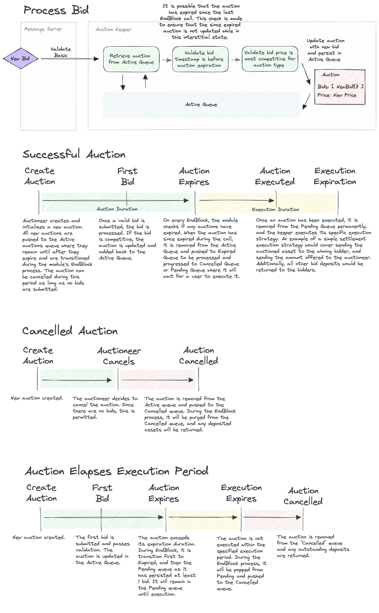
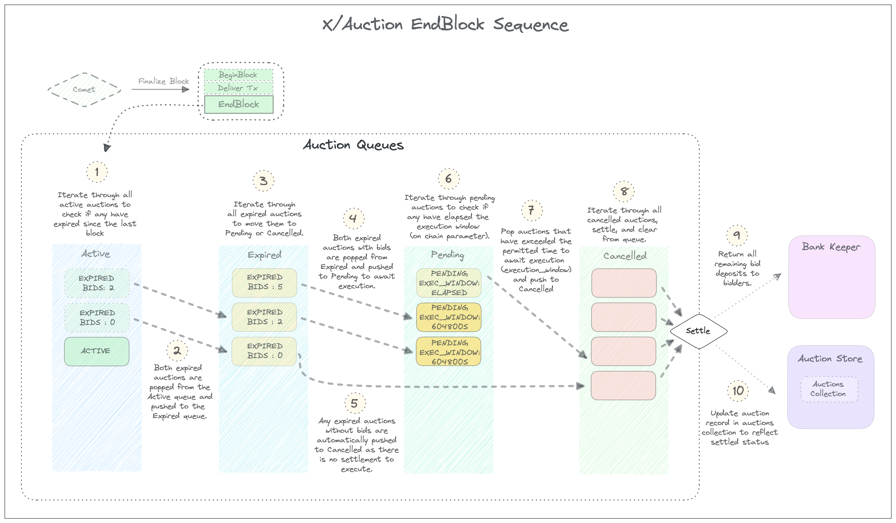

# `x/auction`

Canonical implementation of general purpose permisionless auctions for the Cosmos SDK.

## Concepts

### Auctions

All auctions follow the same state transition logic, but how bids are processed or how the auction is settled depend on the auction type's unique configuration. The goal of `x/auction` is to offer a few default auction configurations in conjunction with a framework for further opportunity to customize auction mechanics and settlement rules.

**Reserve Auction**

The main auction type available is the `ReserveAuction`. Its bid processing rules are limited; a bid is accepted only if it is higher than the reserve price or the last submitted bid. Any bid submitted within its auctioneer defined `extension_duration` (the last few minutes before an auction closes for example), will automatically extend the auction duration by some amount of time.

The default execution strategy for a Reserve Auction is the Simple Settle strategy.

### Execution Strategies

**Simple Settle**

Simple Settle is an execution strategy evocative of its namesake; on execution, it will send the deposited asset to the winning bid, and the amount to the auctioneer. All other bids will be returned.

## State

The Auctions module keeps state on all Auctions and corresponding Bids.

Before an auction has closed, it is also persisted in one of four queues:
- Active Auctions
- Expired Auctions
- Pending Auctions
- Cancelled Auctions

When an auction gets executed, it is removed from the Pending queue updated a final time in the Auctions table.

See the section on [data structures](./data_structures.md) for more information on auction mechanics. 

### Storage

Tables
- Auctions :: Map <UUID, Auction>

Queues
- Active :: Map <UUID, Auction>
- Pending :: Map <UUID, Auction>
- Expired :: Map <UUID, Auction>
- Cancelled :: Map <UUID, Auction>

Indexes
- AuctionsByOwner
- AuctionByBidderAddress
- ActiveAuctions
- BidsByAddress // TBD can filter on status (can access auction via bid)

## State Transitions

### Auctions
All auctions conform to the same state transitions. They can progress either through user interaction (like a bid or execution) or during the EndBlock process when the module has indicated their current state requires a status transition (like expiring or exceeding the execution duration).

The following describe user initiated transitions:
- New Auction
  - Initializes a new Auction in the Auction Table, and add to the `Active` auction queue
- Canceled Auction
  - Only applicable to auctions without bids
  - Pop auction from `Active` queue and push to `Cancelled` queue
- Updated Auction
  - New Bid
    - Only applicable if auction is in `Active` queue
    - Will call `PlaceBid()` on auction which will determine the bid's acceptance
  - Ammended Bid
    - Only applicable if auction is in `Active` queue
    - Bid must represent best effective price for specific `AuctionType`
- Execute Auction
  - Every auction has a custom execution strategy that specifies how to settle assets between the Auctioneer and winner

The following diagram illustrates possible user initiated transitions and the ensuing progressions managed by the module.



### Endblock

See the [EndBlock](#end-block) section for additional information.

- Process Auction Queues
  - Active 
    - Iterate through all `Active` auctions that have officially elapsed their `Duration` and push to the `Expired` queue. 
  - Expired
    - Iterate through all `Expired` auctions.
    - Auctions with at least 1 bid are pushed to `Pending`.
    - Auctions with no bids are pushed to `Cancelled`.
  - Pending
    - Iterate through all `Pending` auctions.
    - Auctions that have not been executed and have elapsed the chain's `auction_expire_time` parameter are pushed to `Cancelled`
  - Cancelled
    - Iterate through all `Cancelled` auctions.
    - Return deposited assets to Auctioneer address
    - Retrieve all bids and return amounts.
    - Remove auction from queue and update state in `Auction` table.

## Invariants
- Auction may only be cancelled while no bids have been placed.
- Bids cannot be placed after auction `duration` has elapsed.
- Bid amount must be the most competitive bid for a given auction type. For example, a reserve auction would only accept a bid with an asking price higher than either the reserve price or most recent bid.
- Auction `duration` cannot be ammended.
- If an auction exceeds the `exec_duration`, it will be cancelled and can no longer be executed. 

## Messages

```protobuf
service Msg {
  rpc CreateAuction(MsgCreateAuctionMessage) returns (MsgCreateAuctionResponse);
}
```

### CreateAuction
```protobuf

message MsgCreateAuctionMessage {
  option (cosmos.msg.v1.signer) = "auctioneer";

  // proposer is the account address of the auctioneer.
  string auctioneer = 1 [(cosmos_proto.scalar) = "cosmos.AddressString"];

  string name = 2;
  
  google.protobuf.Duration duration = 3 [
    (gogoproto.nullable)    = false,
    (gogoproto.stdduration) = true,
    (gogoproto.jsontag)     = "duration,omitempty"
  ];

  google.protobuf.Duration duration_extension = 4 [
    (gogoproto.nullable)    = false,
    (gogoproto.stdduration) = true,
    (gogoproto.jsontag)     = "duration_extension,omitempty"
  ];

  repeated cosmos.base.v1beta1.Coin reserve_price = 5 [
    (gogoproto.nullable)     = false,
    (amino.dont_omitempty)   = true,
    (gogoproto.castrepeated) = "github.com/cosmos/cosmos-sdk/types.Coins"
  ];

  repeated cosmos.base.v1beta1.Coin deposit = 6 [
    (gogoproto.nullable)     = false,
    (amino.dont_omitempty)   = true,
    (gogoproto.castrepeated) = "github.com/cosmos/cosmos-sdk/types.Coins"
  ];
}

message MsgCreateAuctionResponse {
  
}

```

### Bid
```protobuf

message MsgNewBid {
  option (cosmos.msg.v1.signer) = "bidder";
  
}

message MsgAmmendBid {
  option (cosmos.msg.v1.signer) = "bidder";

}
```

### CancelAuction
```protobuf

message MsgCancelAuctionMessage {
  option (cosmos.msg.v1.signer) = "auctioneer";
  
  
}

```

### ExecuteAuction
```protobuf

message MsgExecuteAuctionMessage {
  option (cosmos.msg.v1.signer) = "creator";
  
  
}

```

## End Block
See [Endblock](#endblock) for a full description. 



## Events

**Auction Created**

**Auction Expired**

**Auction Executed**

**Auction Cancelled**

## Client

### CLI

#### `tx`

**Create Auction**

**Cancel Auction**

**Bid**

**Ammend Bid**

**Execute Auction**

#### `query`

**Get Auction By Id**

**Get Auctions By Owner**

**Get Bids By Auction**


## Params

**Auction Expire Time**

Execution duration for pending auctions to be executed. If an auction in `PENDING` state exceeds this time, it will be cancelled and all bids refunded.
```json
{
  "execution_duration": "1209600" // 2 weeks
}
```

## Future Improvements

Describe future improvements of this module.

## Tests

Acceptance tests.

## Appendix

Supplementary details referenced elsewhere within the spec.